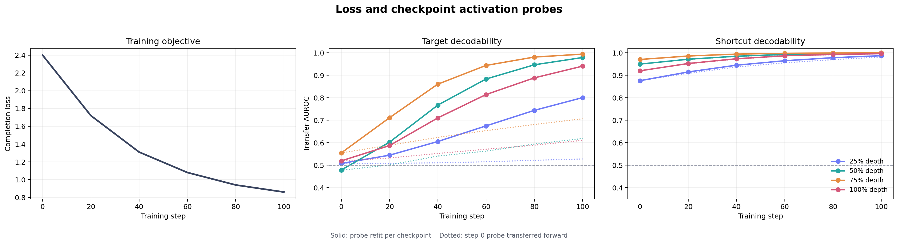

# Activation Probing Lab

A small, reproducible companion project for monitoring what a 4B language model learns during LoRA or QLoRA fine-tuning on NVIDIA CUDA and Apple MLX.

The lab tracks three views of the same run:

1. the training objective;
2. target information that can be decoded from checkpoint activations;
3. a deliberately planted shortcut that the model may learn instead.

It is designed to make the workflow in [Latent Signals: what model internals tell us before the loss curve does](https://latentsig.com/insights/latent-signals-activation-probing/) concrete enough to run on one GPU.

## What this project does

The included toy task teaches `Qwen/Qwen3-4B` an arbitrary routing code. The correct answer depends on a combination of two fields. A source tag agrees with the answer 95 percent of the time in the fine-tuning set, which gives the model an easier but brittle shortcut.

The probe set breaks that correlation and adds a new surface template. At every saved checkpoint, the lab captures the final prompt-token residual stream at 25, 50, 75, and 100 percent of model depth. It then measures:

- target AUROC on held-out and transfer examples;
- shortcut AUROC on the same examples;
- repeated label-permutation controls;
- grouped cross-validation with an L2-regularized linear probe;
- bootstrap confidence intervals;
- a step-0 probe transferred forward, which exposes direction stability or rotation.

This is a diagnostic, not a claim that a decoded feature is causally used by the model.

## Backends, models, and hardware

The backend is selected in the experiment YAML:

```yaml
backend: cuda  # or mlx
```

Both backends write the same compressed NumPy activation schema. Dataset generation, regularized probes, controls, CSV output, and plots are backend-independent.

The default CUDA model is [`Qwen/Qwen3-4B`](https://huggingface.co/Qwen/Qwen3-4B), an Apache-2.0 causal language model with 4.0B parameters and 36 transformer layers. Qwen3 requires Transformers 4.51 or newer.

The training path uses NF4 with double quantization and LoRA adapters. A CUDA GPU with at least 16 GB of memory is a sensible starting point for the default sequence length and batch settings. Exact memory use depends on the CUDA, PyTorch, Transformers, PEFT, and bitsandbytes versions on the machine.

The MLX pilot uses [`mlx-community/Qwen3.5-4B-MLX-4bit`](https://huggingface.co/mlx-community/Qwen3.5-4B-MLX-4bit), a 4-bit conversion of `Qwen/Qwen3.5-4B`. MLX uses the Metal GPU on Apple Silicon. The current activation adapter captures the post-block residual stream from Qwen3.5's hybrid linear-attention and full-attention text model.

No GPU is required for the smoke demo or unit tests.

## Quick start: CPU smoke demo

The smoke demo creates synthetic checkpoint activations with a known target and shortcut direction. It runs the exact same probe and plotting code used by the 4B experiment.

```bash
python -m venv .venv
source .venv/bin/activate
python -m pip install -e .

apl --config configs/qwen3-4b-toy.yaml smoke-demo
```

Open:

```text
runs/smoke-demo/report/probe_trajectories.png
```



This checked-in image comes from synthetic activations, not a Qwen3-4B result. Its purpose is to verify the analysis pipeline and show how the final report is structured.

## Run the 4B experiment

Install the GPU dependencies:

```bash
python -m pip install -e '.[train]'
```

Generate the task:

```bash
apl --config configs/qwen3-4b-toy.yaml generate-data
```

Fine-tune the adapter and save checkpoints at steps 20, 40, 60, 80, and 100:

```bash
apl --config configs/qwen3-4b-toy.yaml train
```

Capture activations for the base model and every saved adapter checkpoint:

```bash
apl --config configs/qwen3-4b-toy.yaml capture
```

Fit the probe panel and render the report:

```bash
apl --config configs/qwen3-4b-toy.yaml probe
```

The main outputs are:

```text
runs/qwen3-4b-toy/report/probe_results.csv
runs/qwen3-4b-toy/report/probe_trajectories.png
runs/qwen3-4b-toy/report/probe_trajectories.svg
```

## Run the Apple MLX pilot

Create a separate Apple Silicon environment and install the MLX dependencies:

```bash
python3.13 -m venv .venv-mlx
source .venv-mlx/bin/activate
python -m pip install -e '.[mlx]'
```

Run the ten-update Qwen3.5 pilot and capture the base model plus checkpoints 2, 4, 6, 8, and 10:

```bash
apl --config configs/qwen3.5-4b-mlx-pilot.yaml generate-data
apl --config configs/qwen3.5-4b-mlx-pilot.yaml train
apl --config configs/qwen3.5-4b-mlx-pilot.yaml capture
```

The training manifest and capture timings are written to:

```text
runs/qwen3.5-4b-mlx-pilot/checkpoints/run_manifest.json
runs/qwen3.5-4b-mlx-pilot/activations/capture_metrics.json
```

### Reference result on an M4 Max

The checked pilot was run on a 40-core M4 Max with 64 GB unified memory:

| Measurement | Result |
| --- | ---: |
| Model download | 2.9 GB, about 122 seconds |
| Total training command | 140.4 seconds including download |
| Warm steady-state training | about 1.56 iterations/second |
| Training peak memory | 10.65 GB |
| Six-checkpoint activation capture | 354.4 seconds |
| Capture peak memory | 3.34 to 3.78 GB |
| Activation tensor per checkpoint | `4 x 1024 x 2560` |

Times vary with system load, model cache state, package versions, and thermal conditions. The pilot trains on completion tokens only, so its token throughput should not be extrapolated to long-form fine-tuning without a longer calibration run.

## Reading the plot

Each color corresponds to a normalized model depth. Solid lines refit a regularized probe at every checkpoint. Dotted lines keep the step-0 probe fixed and apply it to later checkpoints.

A useful learning story looks like this:

- target transfer AUROC rises across checkpoints;
- shortcut AUROC does not dominate the target signal;
- the mean permutation control remains close to chance;
- the fixed step-0 direction and refit probe tell a consistent story.

A warning pattern is target performance rising in-domain while remaining flat on the transfer split, especially when shortcut AUROC rises quickly. That is evidence to inspect the data or training setup, not a reason to declare the run successful because loss fell.

## Experiment layout

```text
generated task
    |
    v
Qwen3-4B + QLoRA checkpoints
    |
    v
fixed prompts + fixed token site + fixed layer fractions
    |
    v
target probe + shortcut probe + controls
    |
    v
checkpoint trajectory and decision evidence
```

## Why the controls matter

The hidden size of Qwen3-4B is 2,560. A small dataset can produce an attractive separating direction through noise alone. This project tunes the ridge strength inside grouped cross-validation and reports a label-permutation baseline.

The target and shortcut labels are balanced independently in every probe split. The transfer split also uses unseen prose templates. These choices make it harder for the probe itself to win by exploiting the same surface correlation planted in the training set.

## Adapt it to your data

The training JSONL schema is:

```json
{"prompt":"...","response":"KITE"}
```

The probe JSONL adds measurement fields:

```json
{
  "id": "probe-00001",
  "prompt": "...",
  "target": 1,
  "shortcut": 0,
  "split": "probe_transfer",
  "group": "source-or-template-family"
}
```

Keep the probe prompts, splits, token site, layer sites, and regularization grid frozen before comparing checkpoints. Replace `target` and `shortcut` with concepts that have operational meaning for your run.

## Tests

```bash
make test
```

The tests do not download a language model. They validate the toy-data balance, layer mapping, checkpoint ordering, regularized probe recovery, and bootstrap interval code.

## References

- [Qwen3-4B model card](https://huggingface.co/Qwen/Qwen3-4B)
- [Transformers bitsandbytes and QLoRA documentation](https://huggingface.co/docs/transformers/main/quantization/bitsandbytes)
- [PEFT LoRA documentation](https://huggingface.co/docs/peft/package_reference/lora)
- [Understanding intermediate layers using linear classifier probes](https://arxiv.org/abs/1610.01644)
- [Designing and Interpreting Probes with Control Tasks](https://aclanthology.org/D19-1275/)
- [QLoRA: Efficient Finetuning of Quantized LLMs](https://arxiv.org/abs/2305.14314)

## License

MIT. See [LICENSE](LICENSE).
